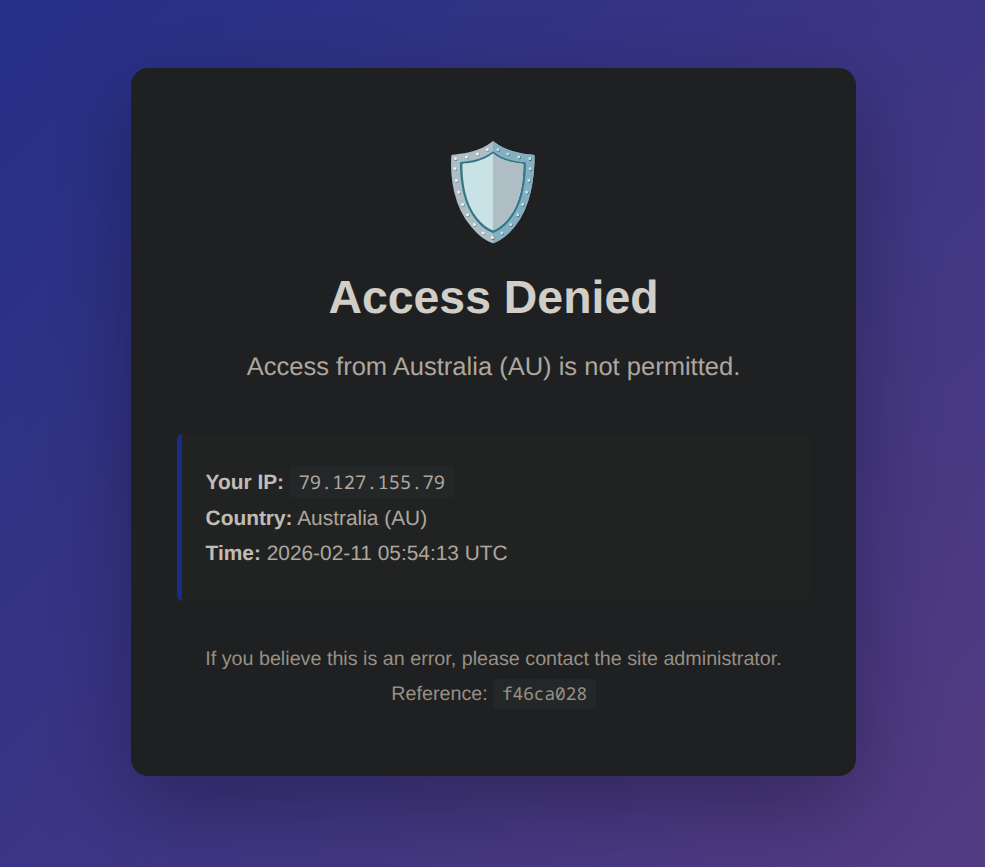
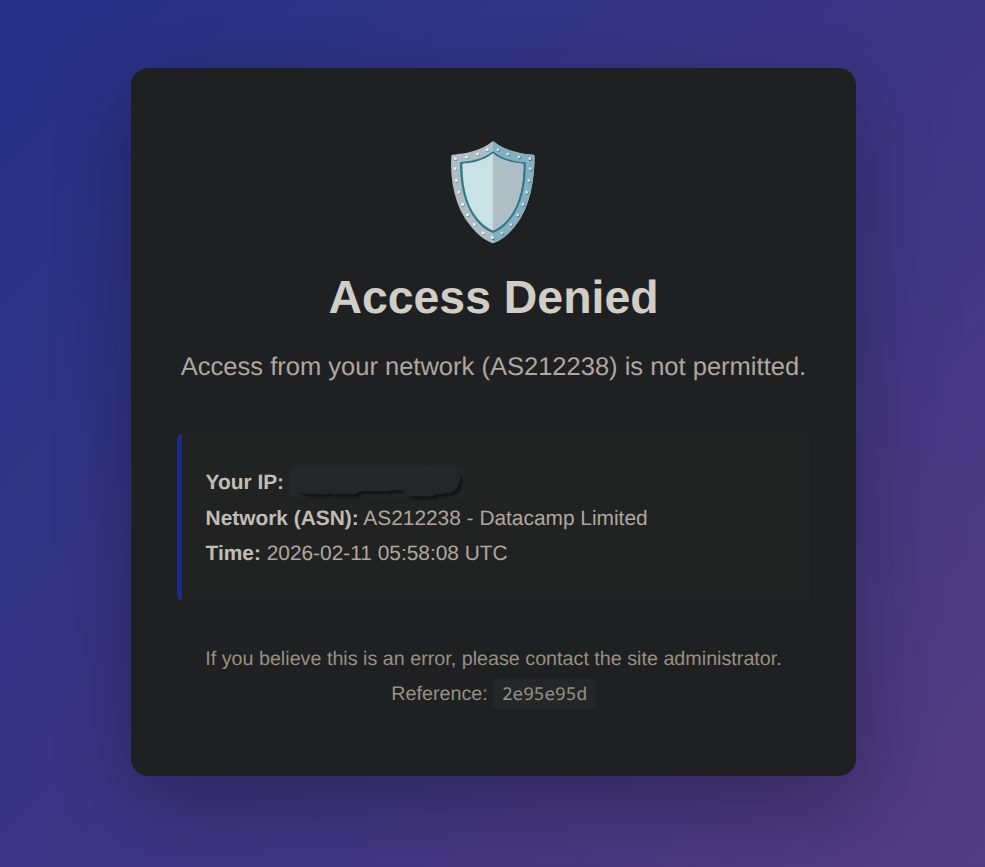

# geo-asn-auth

A Flask ForwardAuth service for your reverse proxy that blocks traffic based on country, ASN, and user-agent using MaxMind databases.

[](https://ghcr.io)
[](https://www.gnu.org/licenses/gpl-3.0)

## Quick Start

There are 4 main requirements to run this application.

* The `docker-compose.yml` file
* The `GeoLite2-city.mmdb` and `GeoLite2-ASN.mmdb` maxmind databases
* A `config.yaml` file
* Configure your reverse proxy (see [Traefik](#traefik), [Nginx](#nginx), or [Caddy](#caddy) instructions)

### Using Docker Compose

```yml "docker-compose.yml"
services:
  geo-asn-auth:
    image: ghcr.io/wildetechsolutions/geo-asn-auth:latest
    # user: "1001:1001"
    container_name: geo-asn-auth
    restart: unless-stopped
    volumes:
      # Mount MaxMind databases (required) This can be a shared location for other Pangolin services
      - ./config/maxmind:/data:ro
      - ./geoblock/config.yaml:/app/config.yaml:ro
    # environment:
      # - PORT=9876 # Service port (default: 9876)

    healthcheck:
      test: ["CMD", "python", "-c", "import urllib.request; urllib.request.urlopen('http://localhost:9876/health')"]
      interval: 30s
      timeout: 10s
      retries: 3
      start_period: 10s
```

See [docker-compose.example.yml](docker-compose.example.yml) for a complete example.

### Maxmind Database

If you do not already have the maxmind databases being pulled, then you can add this to your compose stack

```yml
  maxmind-updater:
    image: maxmindinc/geoipupdate:latest
    container_name: maxmind-updater
    restart: unless-stopped
    volumes:
      - ./config/maxmind:/usr/share/GeoIP
    environment:
      - GEOIPUPDATE_ACCOUNT_ID=${MAXMIND_ACCOUNT_ID}
      - GEOIPUPDATE_LICENSE_KEY=${MAXMIND_LICENSE_KEY}
      - GEOIPUPDATE_EDITION_IDS=GeoLite2-City GeoLite2-Country GeoLite2-ASN
      - GEOIPUPDATE_FREQUENCY=24  # Update every 1 days (in hours)
```

### Default Configuration

Create `config.yaml` to manage your blocking rules.

In this default `config.yaml`, I have the following policies

* Country: `Mode: Whitelist` -> Only the allowed countries pass this check.  All else returns 403
* ASN: `Mode: Blacklist` -> All known datacenter ASNs are blacklisted from provided URL.  
  - Additional ASNs manually added to blacklist.  
  - ASNs can be added to the whitelist for exceptions (VPN provider)
  - ASNs can be added to the whitelist with specific user-agent requirements
* user-agent: `Mode: Blacklist` -> All known bot user-agents are blacklisted from provided URL
  - Additional user-agent values added to blakclist


```yaml
# Country Filtering
countries:
  mode: whitelist  # Options: whitelist, blacklist, disabled
  whitelist:
    - US  # United States
    - CA  # Canada
  blacklist: []

# ASN Filtering
asn:
  mode: blacklist  # Options: whitelist, blacklist, disabled
  
  # Whitelist can be used in two ways:
  # - In "whitelist" mode: Only these ASNs are allowed (strict mode)
  # - In "blacklist" mode: These ASNs are exceptions to the blacklist
  # whitelist:
  #   - 212238  # ProtonVPN - Fully trust an ASN
  #   # Trust an ASN only with specific user_agents
  #   - asn: 212238  # Datacamp (ProtonVPN)
  #     user_agents:
  #       - "Sonarr/*"      # *arr applications only
  #       - "Prowlarr/*"
  #       - "Lidarr/*"
  #       - "Radarr/*"
  
  # Fetch ASN lists from remote URLs (loaded at startup)
  blacklist_urls:
    - https://raw.githubusercontent.com/brianhama/bad-asn-list/refs/heads/master/only%20number.txt
  whitelist_urls: []
  
  # Manual ASN entries (combined with fetched lists)
  blacklist:
    - 16509   # AMAZON-02 (AWS)
    - 13335   # Cloudflare
    - 15169   # Google LLC
    # Add more ASNs with comments...

# User-Agent Filtering
user_agent:
  mode: blacklist  # Options: whitelist, blacklist, disabled
  
  # Fetch user-agent lists from remote URLs (loaded at startup)
  blacklist_urls:
    - https://raw.githubusercontent.com/mitchellkrogza/nginx-ultimate-bad-bot-blocker/refs/heads/master/_generator_lists/bad-user-agents.list
  whitelist_urls: []
  
  # Manual user-agent entries (combined with fetched lists)
  # Uses substring matching (case-insensitive)
  blacklist:
    - "sqlmap"
    - "nikto"
    - "nmap"
    - "bot"
    - "crawler"
    - "python-requests"
  whitelist: []

# domains:
#   integration-api.example.com:
#     ip:
#       mode: whitelist
#       whitelist:
#         - "192.168.1.100"  # Home IP Only
```

## Features

- **Country-based blocking** (whitelist or blacklist)
- **ASN-based blocking** (whitelist or blacklist)
- **User-agent filtering** (blacklist with substring matching)
- Supports MaxMind GeoLite2 Country and ASN databases
- Remote blocklist fetching with caching
- YAML configuration file with inline comments
- Private IP allowance option
- Health check endpoint
- Detailed logging
- Configurable service port





## Configuration

**ASN Mode Behavior:**
- **`whitelist` mode**: Only ASNs in whitelist are allowed (strict deny-by-default)
- **`blacklist` mode**: ASNs in blacklist are blocked, BUT whitelist entries are exceptions (useful for trusting specific VPNs/services while blocking all other datacenters)
- **`disabled` mode**: No ASN filtering


**Remote ASN Lists:**
- Lists are fetched at container startup and combined with manual entries
- **Caching**: Downloaded lists are cached for 168 hours (7 days) in `/blocklists` to avoid re-downloading on every restart
- **Local files**: Place custom ASN list files in `./geo-asn-auth/blocklists/` and reference them as `/blocklists/filename.txt`
- Supports any URL or file with one ASN per line (comments with `#` are ignored)
- Example: brianhama/bad-asn-list contains 1277+ datacenter/hosting ASNs
- Failed fetches are logged but don't prevent startup
- Manual entries are preserved and merged with remote lists

**User-Agent Lists:**
- User-agent blacklists/whitelists work the same way as ASN lists
- **Matching**: Uses substring matching (case-insensitive) - "bot" will match "MyBot/1.0" and "botnet"
- Example: mitchellkrogza list contains ~4000 known bad user-agents (scrapers, crawlers, scanners)
- **Performance**: Compiled regex patterns add ~0.3-0.5ms per request

**Example with local file:**
```bash
# Create custom ASN list
echo "12345" > ./geo-asn-auth/blocklists/my-custom-asns.txt
echo "67890" >> ./geo-asn-auth/blocklists/my-custom-asns.txt
```

```yaml
# In config.yaml:
blacklist_urls:
  - /blocklists/my-custom-asns.txt  # Local file
  - https://raw.githubusercontent.com/brianhama/bad-asn-list/refs/heads/master/only%20number.txt  # Remote (cached)
```

### Domain-Specific Overrides

You can override global settings for specific domains by adding a `domains:` section to your `config.yaml`. This is useful when different sites/APIs need different protection rules.

**Matching**: Domains are matched against the `Host` header. Supports exact matches and wildcards (`*.example.com`).

**Three Override Strategies:**

1. **REPLACE** (default) - Ignore global config, use only domain-specific settings
2. **PARTIAL OVERRIDE** - Override specific sections, inherit others
3. **EXTEND** - Merge with global config using `extend_global: true`

**Example: Admin Panel with IP Whitelist Only**
```yaml
domains:
  admin.example.com:
    ip:
      mode: whitelist
      whitelist:
        - "192.168.1.100"  # Office IP
        - "10.0.0.50"      # VPN IP
    countries:
      mode: disabled  # Don't check country
    asn:
      mode: disabled
    user_agent:
      mode: disabled
    settings:
      allow_lan: false  # Strict IP matching only
```

**Example: API with Different Country Rules**
```yaml
domains:
  api.example.com:
    countries:
      mode: blacklist  # Override just the country mode
      blacklist:
        - CN  # Block China
        - RU  # Block Russia
    # ASN and user_agent inherit from global config
```

**Example: Domain with Additional VPN Exceptions**
```yaml
domains:
  vpn-allowed.example.com:
    extend_global: true  # Merge instead of replace
    asn:
      whitelist:
        - 212238  # Add ProtonVPN to global whitelist
        - 9009    # Add another VPN
    # All other global settings still apply
```

**Example: Wildcard for All Subdomains**
```yaml
domains:
  *.internal.example.com:
    ip:
      mode: whitelist
      whitelist:
        - "10.0.0.0/8"  # Internal network only
    countries:
      mode: disabled
    asn:
      mode: disabled
```

### Environment Variables (docker-compose.yml)

Basic settings can be configured via environment:

```yaml
environment:
  - PORT=9876                      # Service port
  - ALLOW_LAN=true                 # Allow private/LAN IPs
  - ALLOW_UNKNOWN=true             # Allow when geo data unavailable
  - CACHE_HOURS=168                # Blocklist cache duration (default: 7 days)
  - CONFIG_PATH=/app/config.yaml
  - COUNTRY_DB_PATH=/data/GeoLite2-Country.mmdb
  - ASN_DB_PATH=/data/GeoLite2-ASN.mmdb
```

## Filtering Modes

- **whitelist**: Only allow specified countries/ASNs/user-agents (block all others)
- **blacklist**: Block specified countries/ASNs/user-agents (allow all others)
- **disabled**: Skip this check entirely

**Note**: For ASN blacklist mode, the whitelist acts as an exception list (e.g., trust specific VPNs while blocking all other datacenters).

## MaxMind Database Setup

1. Sign up for free MaxMind account: https://www.maxmind.com/en/geolite2/signup
2. Download GeoLite2 Country and ASN databases
3. Place `.mmdb` files in the directory you mount as `/data` in the container

## Reverse Proxy Integration

This service works as a ForwardAuth/External Authentication middleware for reverse proxies. **Every HTTP request** is processed by geo-asn-auth before reaching your application.

### Request Flow

1. Request arrives at reverse proxy
2. **geo-asn-auth** checks IP/user-agent against rules
3. If blocked: Returns 403 (request stops)
4. If allowed: Returns 200 (request continues to application)

---

## Traefik

### Step 1: Define the ForwardAuth middleware

Edit your Traefik dynamic configuration file (e.g., `dynamic_config.yml`):

```yaml
http:
  middlewares:
    geoblock:
      forwardAuth:
        address: http://geo-asn-auth:9876/verify
        trustForwardHeader: true
        authResponseHeaders:
          - X-Geo-Country
          - X-Geo-ASN
```

**Configuration details:**
- `address`: Must match your geo-asn-auth container name and port
- `trustForwardHeader`: Required to read `X-Forwarded-For` header
- `authResponseHeaders`: Optional headers passed to your application

### Step 2: Apply middleware globally or per-route

**Option A: Global (All Routes)**

Edit your Traefik static configuration file (e.g., `traefik_config.yml`):

```yaml
entryPoints:
  web:
    address: :80
    http:
      middlewares:
        - geoblock@file
  websecure:
    address: :443
    http:
      middlewares:
        - geoblock@file
```

This applies geo-asn-auth to **all HTTP/HTTPS traffic** at the entry point level.

**Option B: Per-Route**

Edit your dynamic configuration file:

```yaml
http:
  routers:
    my-app-router:
      rule: "Host(`example.com`)"
      entryPoints:
        - websecure
      middlewares:
        - geoblock  # Apply geo-asn-auth to this route only
        - security-headers
      service: my-app-service
      tls:
        certResolver: letsencrypt
```

### Step 3: Restart Traefik

```bash
docker compose restart traefik
```

### Verifying Integration

Check Traefik logs:

```bash
docker logs traefik | grep -i forward
```

Check geo-asn-auth logs:

```bash
docker logs geo-asn-auth
```

---

## Nginx

### Global Configuration (All Requests)

Edit your main Nginx configuration (e.g., `/etc/nginx/nginx.conf`):

```nginx
http {
    # Apply auth_request globally to all server blocks
    auth_request /auth;
    auth_request_set $auth_status $upstream_status;
    
    # Define the auth endpoint once
    location = /auth {
        internal;
        proxy_pass http://geo-asn-auth:9876/verify;
        proxy_pass_request_body off;
        proxy_set_header Content-Length "";
        proxy_set_header X-Forwarded-For $remote_addr;
        proxy_set_header X-Original-URI $request_uri;
    }
    
    # All server blocks now inherit auth_request automatically
    server {
        listen 80;
        server_name example.com;
        
        location / {
            proxy_pass http://backend:8080;
        }
    }
}
```

### Per-Server Configuration

If you only want to protect specific sites, place `auth_request` in individual server blocks:

```nginx
http {
    # Define auth endpoint in http block (shared)
    location = /auth {
        internal;
        proxy_pass http://geo-asn-auth:9876/verify;
        proxy_pass_request_body off;
        proxy_set_header Content-Length "";
        proxy_set_header X-Forwarded-For $remote_addr;
    }

    # Protected server
    server {
        listen 80;
        server_name protected.com;
        
        auth_request /auth;  # Enable for this server only
        auth_request_set $auth_status $upstream_status;
        
        location / {
            proxy_pass http://backend:8080;
        }
    }
    
    # Unprotected server
    server {
        listen 80;
        server_name public.com;
        # No auth_request - this site is not protected
        
        location / {
            proxy_pass http://other-backend:8080;
        }
    }
}
```

### Disable for Specific Locations

Override globally-applied auth for specific paths:

```nginx
server {
    listen 80;
    server_name example.com;
    
    location / {
        # Inherits global auth_request
        proxy_pass http://backend:8080;
    }
    
    location /public {
        auth_request off;  # Disable auth for this path
        proxy_pass http://backend:8080;
    }
}
```

### Reload Nginx

```bash
nginx -t  # Test configuration
nginx -s reload  # Or: docker exec nginx nginx -s reload
```

---

## Caddy

### Global Configuration (All Sites)

Using a reusable snippet in your Caddyfile:

```caddyfile
# Define reusable snippet
(geoblock) {
    forward_auth geo-asn-auth:9876 {
        uri /verify
        copy_headers X-Geo-Country X-Geo-ASN
    }
}

# Apply to all sites
*.example.com {
    import geoblock
    reverse_proxy backend:8080
}

other-site.com {
    import geoblock
    reverse_proxy other-backend:8080
}
```

### Wildcard Global Application

Apply to all traffic using a catch-all:

```caddyfile
:80, :443 {
    forward_auth geo-asn-auth:9876 {
        uri /verify
        copy_headers X-Geo-Country X-Geo-ASN
    }
    
    @site1 host site1.com
    handle @site1 {
        reverse_proxy backend1:8080
    }
    
    @site2 host site2.com
    handle @site2 {
        reverse_proxy backend2:8080
    }
}
```

### Per-Site Configuration

Apply only to specific sites:

```caddyfile
# Protected site
protected.com {
    forward_auth geo-asn-auth:9876 {
        uri /verify
        copy_headers X-Geo-Country X-Geo-ASN
    }
    reverse_proxy backend:8080
}

# Unprotected site
public.com {
    # No forward_auth - not protected
    reverse_proxy other-backend:8080
}
```

### Reload Caddy

```bash
caddy reload  # Or: docker exec caddy caddy reload
```

---

## Endpoints

- `GET /verify` - ForwardAuth verification (used by Traefik)
- `GET /health` - Health check and configuration status

## Testing

Check health status:
```bash
curl http://localhost:9876/health
```

Test from specific IP (for testing, temporarily expose port):
```bash
curl -H "X-Forwarded-For: 8.8.8.8" http://localhost:9876/verify
```

Use the `maxmind-geoipupdate` container to keep databases current.

## License

This project is licensed under the GNU General Public License v3.0 - see the [LICENSE](LICENSE) file for details.

## Support

- Report issues: https://github.com/WildeTechSolutions/geo-asn-auth/issues
- Questions: https://github.com/WildeTechSolutions/geo-asn-auth/discussions

## Logs

View logs:
```bash
docker logs -f geo-asn-auth
```

Logs show:
- Allowed/blocked requests with reason
- IP, country, and ASN information
- Configuration validation
- Database loading status
